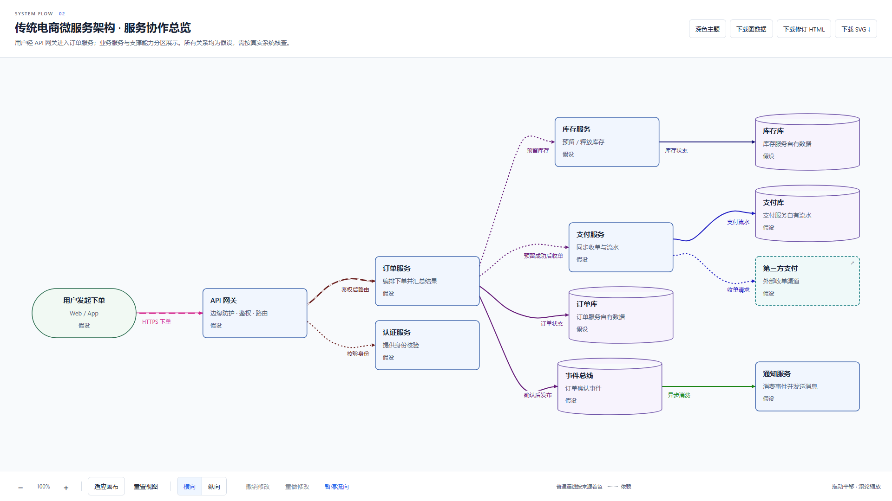
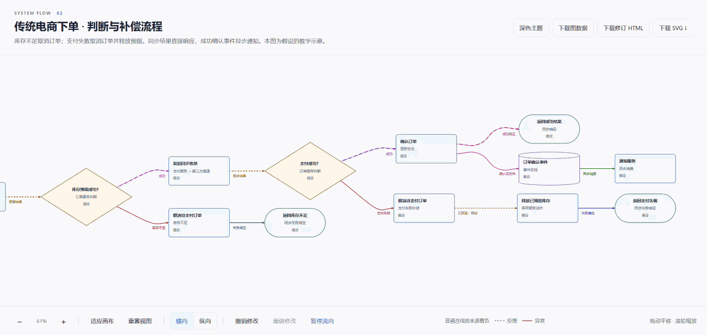
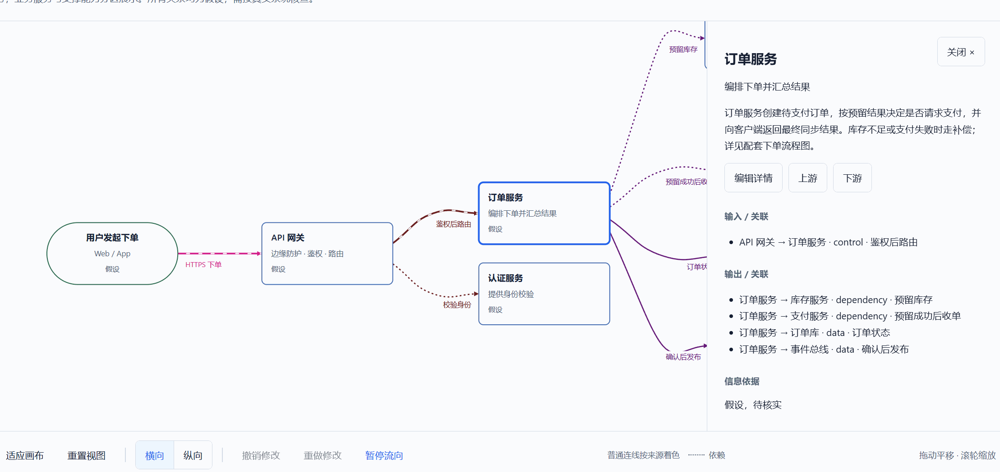
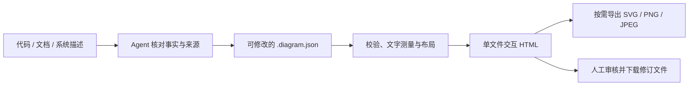

<div align="center">

# System Flow

**把软件系统的结构与运行路径，画成可核对、可修改的流程图。**

从代码、文档或系统描述提取节点与关系，生成可离线阅读的交互 HTML，以及适合放进 README、文档和汇报中的静态图。

   

[效果预览](#效果预览) · [核心能力](#核心能力) · [快速开始](#快速开始) · [安装 Skill](#安装-skill) · [演示文件](examples/README.md)

</div>

## 项目简介

System Flow 是一个面向**软件架构与运行流程**的本地绘图 Skill。Agent 先核对事实和来源，再把组件、调用、数据流、判断与分组写入 `.diagram.json`；程序负责校验、文字测量、布局、渲染和导出。它适合解释“系统由什么组成、请求如何流转、模块如何协作”，不以项目排期或甘特图为目标。

每张图同时保留可继续修改的源数据、单文件交互 HTML 和按需生成的 SVG / PNG / JPEG。阅读 HTML 不需要账号、服务器或网络；生成所需的运行时已包含在 `system-flow/` 子目录中。

## 效果预览

### 静态示例 · 传统电商微服务架构

这张预览由[架构总览交互 HTML](examples/traditional-microservices.html)在浏览器中截取。点击图片可查看原尺寸；下载 HTML 后可离线缩放、平移、切换横纵布局和审核节点详情。

[](images/traditional-microservices-preview.png)

[图数据](examples/traditional-microservices.diagram.json) · [交互 HTML](examples/traditional-microservices.html) · [预览 PNG](images/traditional-microservices-preview.png)

### 动态示例 · 下单流程

下载交互 HTML 后，可离线切换横向/纵向布局、查看分支详情、折叠分组并编辑审核。此示例默认横向布局。

[](images/traditional-microservices-order-flow.gif)

[图数据](examples/traditional-microservices-order-flow.diagram.json) · [交互 HTML](examples/traditional-microservices-order-flow.html) · [演示 GIF](images/traditional-microservices-order-flow.gif)

### 可编辑示例 · 详情板审核

这段录屏展示节点详情板和“编辑详情”入口。下载[交互 HTML](examples/traditional-microservices-order-flow.html)后，可点击已有节点、连接或分组，修改名称、说明、条件、方向和来源；保存后画布会按修订数据更新，再下载图数据与修订 HTML 留存。录屏本身只展示入口，实际修改请在 HTML 中操作。

[](images/1.gif)

上述两份图数据是教学示意，节点及连接中的“假设”需要按真实系统核查，不代表本仓库或任何实际系统的部署状态。[两份演示图](examples/README.md)另有索引。

## 核心能力

| 能力 | 说明 |
| --- | --- |
| 可读布局 | 先测量文字，再用 ELK.js 布局；复杂架构可横向，简单流程可纵向，并可在画布上手动切换方向。 |
| 清晰关系 | 节点与连线按语义使用克制的多色系；简单连线为直线，适合平滑的避障路径使用连续曲线，箭头与标签保留方向和条件。 |
| 交互阅读 | 缩放、平移、适应画布、节点和连接详情、上下游高亮、两层分组折叠；主路径可显示缓慢流向，也可暂停。 |
| 人工审核 | 点击已有节点、连接或分组，在详情板修改名称、说明、来源、关系端点与条件等字段；校验通过后重新布局，支持撤销和重做。 |
| 离线交付 | HTML 将图数据、样式和脚本封装在单文件中；静态 SVG 完整展开，PNG/JPEG 可由本地 Chromium 导出。 |

详情板编辑的是**图的描述**，不会修改真实系统代码；增删对象或修改 ID 仍应编辑原始 JSON。审核后使用“下载图数据”和“下载修订 HTML”保存结果，`file://` 页面不会自动覆盖磁盘上的原文件。动效只辅助阅读，不表示实时监控；静态导出不含动效、当前缩放或选中状态。

## 工作流程



Agent 负责建立有来源的图数据；本地程序负责校验与生成。图中的“已证实、假设、规划”状态仍需由读者依据来源审核。

## 技术栈

| 环节 | 技术 |
| --- | --- |
| 模型校验 | JSON Schema、Ajv |
| 布局与渲染 | ELK.js、SVG / CSS、d3-zoom |
| 单文件构建 | TypeScript、esbuild |
| 浏览器验证与位图导出 | Playwright、Chromium |

## 项目结构

```text
system-flow/        可独立复制的 Skill、已构建运行时和导出脚本
src/                模型、投影、测量、布局、渲染、阅读器与 CLI 源码
examples/           两份演示图的 JSON 与离线 HTML
images/             README 使用的 PNG/GIF 预览
tests/              单元和浏览器回归
docs/               面向使用者的操作说明
```

## 快速开始

生成环境为 **Node.js 24.x**。克隆仓库后，无需安装根目录依赖即可校验并生成示例：

```bash
node system-flow/scripts/validate.mjs examples/traditional-microservices.diagram.json
node system-flow/scripts/generate.mjs examples/traditional-microservices.diagram.json --output output/microservices.html
```

在浏览器中打开 `output/microservices.html`。如果需要自动导出静态图，先在 Skill 子目录安装 Playwright 和 Chromium：

```bash
npm ci --prefix system-flow
node system-flow/node_modules/playwright/cli.js install chromium
node system-flow/scripts/export.mjs output/microservices.html --format svg --output output/microservices.svg
node system-flow/scripts/export.mjs output/microservices.html --format png --scale 2 --output output/microservices.png
node system-flow/scripts/export.mjs output/microservices.html --format jpg --background "#FFFFFF" --output output/microservices.jpg
```

生成与导出默认不覆盖已有文件，确需替换时添加 `--overwrite`。浏览器工具栏也可直接下载 SVG；PNG/JPEG 的 CLI 导出需要本地 Chromium。更多字段、条件和分组规则见[建模说明](system-flow/references/modeling.md)。

## 安装 Skill

将完整的 [`system-flow/`](system-flow/) 目录复制到编程工具的 Skills 目录，保持目录名为 `system-flow`。Codex 的当前官方个人安装路径是 `~/.agents/skills/system-flow/`；Claude Code、Cursor、GitHub Copilot 和 Gemini CLI 也支持读取 `SKILL.md`，各工具的个人与项目安装位置见[编程工具安装指南](docs/agent-setup.md)。展示名和触发名是 **System Flow / `system-flow`**。复制时需保留 `SKILL.md`、`LICENSE`、`agents/`、`assets/`、`references/`、`scripts/` 与锁文件。生成只需要 Node.js 24；仅在需要 CLI 位图导出时，在复制后的目录中执行 `npm ci` 并安装 Chromium。

可这样向 Agent 提出任务：

```text
使用 $system-flow，核对这个仓库的主要模块和调用关系，生成架构总览及关键请求流程。
区分已证实、假设和规划，保留重要条件、回路、分组边界与来源。
交付可修改的 .diagram.json、离线交互 HTML 和 README 可嵌入的 SVG，
实际打开检查文字、连线和交互，并标明尚待人工核对的地方。
```

完整使用说明与约束见 [SKILL.md](system-flow/SKILL.md)。

## 开发检查

修改 TypeScript 源码时，在仓库根目录安装开发依赖、重新构建并检查生成物：

```bash
npm ci
npm run typecheck
npm run test:unit
npm run build
npm run check:build
npm run test:browser
npm run examples:check
```

`npm run examples:generate` 会重新生成两份演示 HTML 和 README 预览 PNG；`examples:check` 只读检查已有交付。两条命令都会在忽略的临时目录验证 SVG/PNG/JPEG 导出，不把这些格式作为仓库演示文件保存。浏览器测试需事先安装 Playwright Chromium。独立复制验证可运行 `npm run test:package`；打包与发布在图形验收后另行处理。

## 更多文档与限制

- [使用说明](docs/usage.md)：生成、交互审核与静态导出。
- [编程工具安装指南](docs/agent-setup.md)：Skill 安装位置与适用边界。
- [演示文件索引](examples/README.md)：两份教学示意图及源数据。
- [建模说明](system-flow/references/modeling.md)：字段、条件、分组与事实状态。

自动布局无法保证任意复杂图都没有交叉；生成后仍需检查事实、文字、方向和布局。旧 v1 HTML / SVG 可使用兼容入口导出位图，但不能无损转换为可编辑图数据；详细限制见 [SKILL.md](system-flow/SKILL.md)。

## 开源许可证

本项目的原创内容采用 [MIT License](LICENSE)。独立复制 `system-flow/` Skill 时，请一并保留其中的 [LICENSE](system-flow/LICENSE)；所含第三方组件仍遵循各自的许可证，详见[第三方声明](system-flow/THIRD_PARTY_NOTICES.md)。
