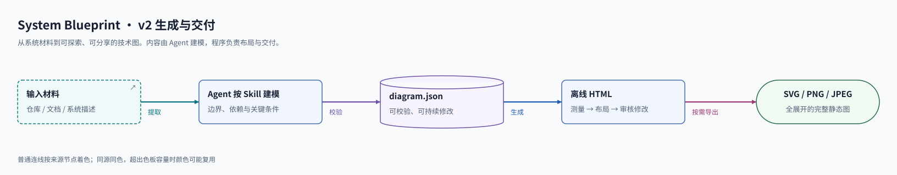
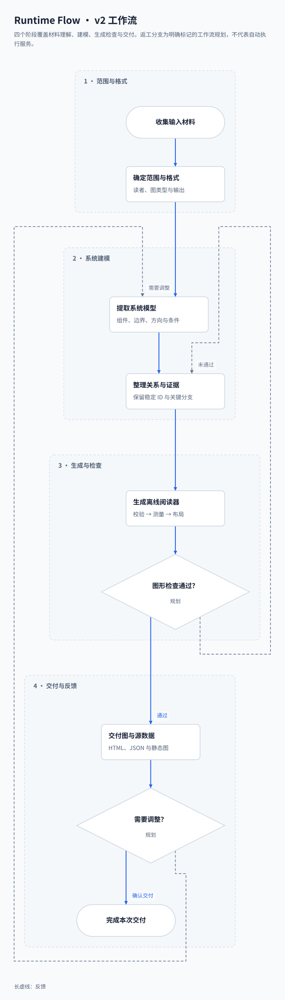
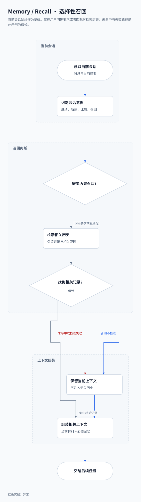
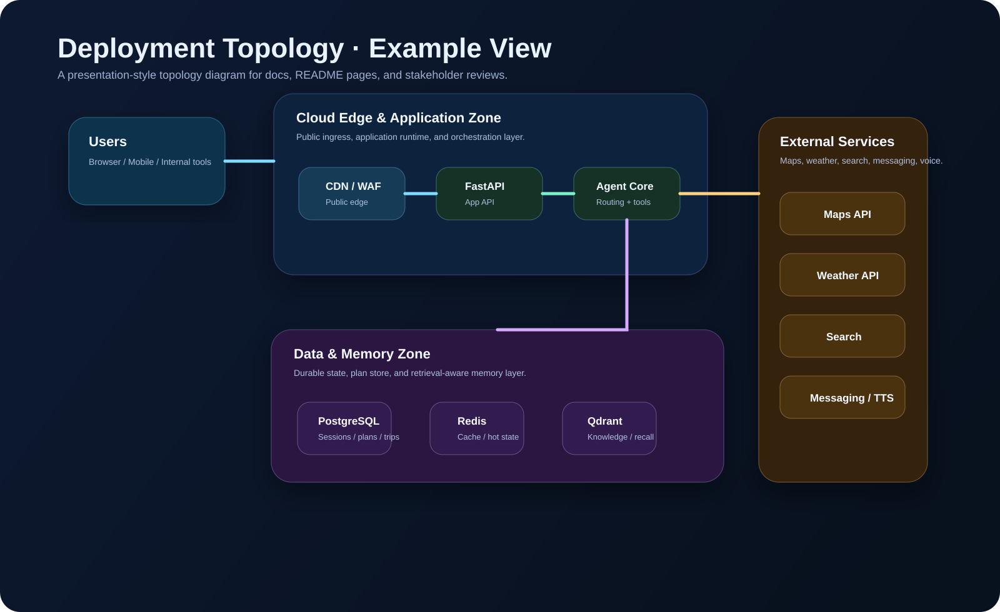
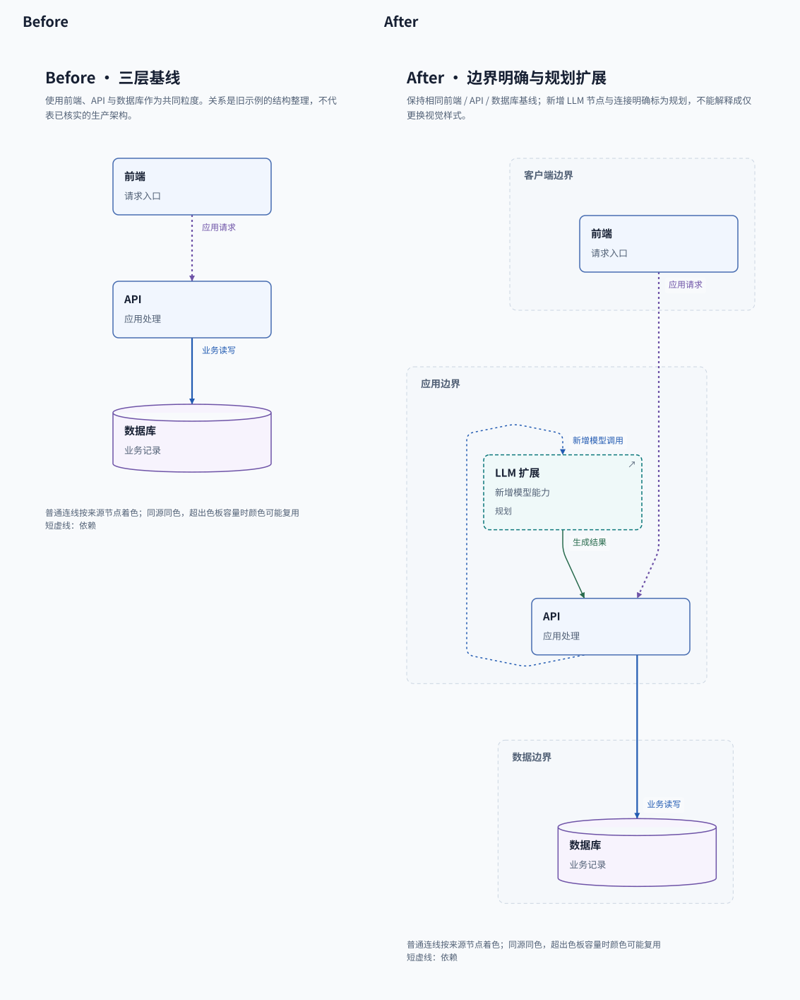

# System Blueprint

面向 AI Agent 的通用技能包，用来生成更适合展示、评审和沉淀文档的系统蓝图与技术图示。

它的目标不是再产出一份“能跑就行”的 Mermaid，而是让 Agent 在合适的时候直接生成可交付的图形资产：

- 独立 `HTML` 文件，内联 `SVG`，适合浏览器打开、演示和方案评审
- 可直接嵌入 GitHub README 的 `SVG`
- 需要投递、截图或发群时可导出 `PNG / JPG`

这个仓库当前以 `SKILL.md + assets/ + scripts/` 的轻量结构组织，优先面向 Codex，也尽量兼容支持类似 Skill 结构的其他 Agent 工作流。

[查看仓库](https://github.com/JX05120LLL/system-blueprint) · [如果这个项目对你有帮助，欢迎点个 Star](https://github.com/JX05120LLL/system-blueprint/stargazers)

---

## 为什么做这个项目

很多 Agent 已经可以根据代码仓库、需求文档或口头描述快速生成架构图，但常见问题也很明确：

- 图能表达结构，但展示质量一般
- 细节很多，但层次不清
- 适合临时说明，不适合放进 README、设计文档或汇报材料
- 输出往往强绑定某个平台，不方便迁移和复用

`System Blueprint` 解决的是这类中间地带的问题：

- 比纯文本图更适合展示
- 比重型设计工具更轻量
- 比平台私有插件更通用

---

## 它能做什么

这个 skill 适合生成以下类型的技术图：

- 系统架构图
- 系统蓝图 / 分层关系图
- 部署拓扑图
- 请求流 / 控制流图
- 数据流图
- Agent Runtime 图
- Memory / Recall 流程图
- Before / After 架构对比图
- 集成关系图 / 组件关系图

默认输出策略：

- 优先输出独立 `HTML` 文件，内联 `SVG`
- 需要 README 嵌入时输出 `SVG`
- 需要位图时用脚本导出 `PNG / JPG`
- 只有在用户明确要求 Mermaid，或者目标环境只能接受 Markdown 图时，才回退到 Mermaid

---

## 预览

下面这些示例图可以直接放进 GitHub README、项目文档或方案说明。

### 1. System Overview



### 2. Runtime Flow



### 3. Memory / Recall



### 4. Deployment Topology



### 5. Before / After



---

## 适合谁用

如果你经常需要让 Agent 帮你产出“能展示”的技术图，这个 skill 会比较合适：

- 想给项目仓库补一张真正能看的架构图
- 想把已有 Mermaid 升级成更适合评审的视觉稿
- 想给 Agent 系统、工作流系统、RAG 系统补运行时说明图
- 想把部署关系、数据边界、外部依赖讲清楚
- 想把设计讨论结果沉淀成可分享的产物

---

## 仓库结构

```text
system-blueprint-skill/
├── README.md
├── images/
│   ├── system-blueprint-overview.svg
│   ├── system-blueprint-runtime-flow.svg
│   ├── system-blueprint-memory-recall.svg
│   ├── system-blueprint-deployment-topology.svg
│   └── system-blueprint-before-after.svg
└── system-blueprint/
    ├── SKILL.md
    ├── agents/
    │   └── openai.yaml
    ├── assets/
    │   └── template.html
    └── scripts/
        └── export_diagram.py
```

各目录作用：

- `system-blueprint/SKILL.md`
  skill 的核心说明文件，定义触发方式、工作流、输出约定和图形规则。

- `system-blueprint/assets/template.html`
  默认模板，生成独立 HTML 蓝图时优先使用。

- `system-blueprint/scripts/export_diagram.py`
  将 `HTML / SVG` 导出为 `PNG / JPG / JPEG` 的辅助脚本。

- `system-blueprint/agents/openai.yaml`
  面向 Codex / OpenAI 风格环境的增强元数据。

- `images/`
  README 预览图和可直接复用的示例 SVG。

---

## 安装方式

### 1. 在 Codex 中安装

把仓库里的 `system-blueprint/` 目录复制到本地 skills 目录：

```bash
~/.codex/skills/system-blueprint/
```

也就是说，最终结构应该类似这样：

```text
~/.codex/skills/system-blueprint/
├── SKILL.md
├── agents/
├── assets/
└── scripts/
```

如果你是从当前仓库安装，复制的是这个目录：

```text
system-blueprint/
```

而不是整个仓库根目录。

### 2. 通过 zip / 文件夹分发

如果你的 Agent 环境支持上传 zip 或导入本地目录，也可以直接打包 `system-blueprint/` 这个目录进行安装。

### 3. 兼容其他支持 `SKILL.md` 的 Agent

这个项目刻意采用较轻的 Skill 结构：

- `SKILL.md`
- `assets/`
- 可选的 agent 元数据

因此它通常比较容易适配到支持相似约定的 Agent 系统里。  
需要注意的是，不同平台对 Skill 元数据、触发词和资源目录的约定并不完全一致，落地时可能需要做少量目录或配置调整。

---

## 如何使用

这个仓库不是传统意义上的 Web 服务或 CLI 主程序。

它的“运行方式”分成两部分：

- 在 Agent 中通过 prompt 触发 skill
- 在本地通过导出脚本把 HTML / SVG 转成 PNG / JPG

### 1. 在 Agent 中触发

你可以直接这样描述任务：

```text
使用 system-blueprint，为这个仓库生成一份独立 HTML 系统架构图。
```

```text
使用 system-blueprint，根据下面的系统描述生成部署拓扑图，输出为独立 HTML，并附带一个适合 README 的 SVG 版本。
```

```text
使用 system-blueprint，把这张 Mermaid 图升级成更适合展示的 HTML + SVG 架构图。
```

```text
使用 system-blueprint，绘制这个 Agent 系统的请求流、意图路由、状态变化和 recall 流程。
```

### 2. 推荐的输入来源

这个 skill 适合从以下输入构建图：

- 代码仓库
- 系统设计文档
- PRD / 技术方案
- Mermaid 草图
- 自然语言描述

### 3. 推荐的输出形式

如果你没有特别指定，建议优先让 Agent 输出：

- 一份独立 `HTML`
- 一份 README 友好的 `SVG`

这样同时兼顾：

- 展示效果
- 仓库文档嵌入
- 后续继续迭代

---

## 典型提示词

### 从代码仓库生成系统蓝图

```text
使用 system-blueprint，分析这个仓库并生成一份系统蓝图。
要求：
1. 输出独立 HTML 文件
2. 使用内联 SVG
3. 保持深色技术风格
4. 重点体现入口层、应用层、数据层和外部依赖
5. 额外输出一个适合 README 的 SVG
```

### 把 Mermaid 升级成展示版图

```text
使用 system-blueprint，把下面这份 Mermaid 图升级成更精美的 HTML 架构图。
要求保留原始结构，但增强分组、颜色语义、标题、副标题和图例。
```

### 生成部署拓扑图

```text
使用 system-blueprint，根据下面描述生成部署拓扑图：
- 前端运行在 Vercel
- API 服务运行在 Railway
- PostgreSQL 托管在 Neon
- Redis 用于缓存
- 外部依赖包括 OpenAI、Stripe 和邮件服务
输出独立 HTML，并附带 SVG。
```

### 生成 Agent Runtime / Memory 图

```text
使用 system-blueprint，绘制一个 Agent 系统的运行时流程图。
重点展示：
- 用户请求进入
- 意图判断
- 工具调用
- 记忆检索
- 结果汇总
- 最终响应
输出为独立 HTML。
```

---

## 输出约定

skill 默认遵循以下约定：

- 文件优先自包含，不依赖外部前端运行时
- 视觉核心使用内联 `SVG`
- 尽量不依赖 JavaScript
- 默认输出适合展示的深色技术风格
- 优先关注结构表达和层次清晰，而不是堆砌装饰

推荐输出文件名：

- `system-blueprint.html`
- `runtime-architecture.html`
- `deployment-topology.html`
- `agent-memory-flow.html`

推荐图片名：

- `system-blueprint-overview.svg`
- `runtime-flow.svg`
- `deployment-topology.svg`
- `agent-memory-flow.png`

---

## 位图导出

如果你已经有生成好的 `HTML` 或 `SVG`，可以用仓库内的脚本继续导出成 `PNG / JPG / JPEG`。

### 脚本位置

```text
system-blueprint/scripts/export_diagram.py
```

### 安装依赖

当前脚本依赖以下 Python 包：

```bash
pip install cairosvg beautifulsoup4 pillow
```

说明：

- `cairosvg` 用于把 `SVG` 渲染成位图
- `beautifulsoup4` 用于从 HTML 中提取内联 `svg`
- `Pillow` 用于保存 `JPG / JPEG`

### 用法示例

在当前仓库根目录下：

```bash
python system-blueprint/scripts/export_diagram.py images/system-blueprint-overview.svg --format png
```

```bash
python system-blueprint/scripts/export_diagram.py images/system-blueprint-overview.svg --format jpg
```

如果你已经有某个独立 HTML 蓝图文件：

```bash
python system-blueprint/scripts/export_diagram.py docs/travel-agent-system-blueprint.html --format png
```

指定输出路径：

```bash
python system-blueprint/scripts/export_diagram.py images/system-blueprint-overview.svg --format png --output output/overview.png
```

调整导出缩放倍率：

```bash
python system-blueprint/scripts/export_diagram.py images/system-blueprint-overview.svg --format png --scale 2.5
```

导出 JPEG 时指定背景色：

```bash
python system-blueprint/scripts/export_diagram.py images/system-blueprint-overview.svg --format jpg --background "#08111E"
```

### Windows 说明

在部分 Windows 环境里，除了 Python 包本身，还可能需要系统可用的 Cairo 运行库。  
如果导出时报找不到相关动态库，通常就是 Cairo 运行时缺失导致的。

如果你当前只是想在 GitHub README 中展示图，优先直接使用 `SVG`，依赖更少，也更稳定。

---

## 设计原则

这个 skill 在图形生成上遵循几条明确原则：

- 先抽系统模型，再画图
- 优先表达层次、边界和关键流
- 第一版先克制，避免把图画得过满
- 分组容器优先于散点堆叠
- 语义配色优先于花哨装饰
- 标题和副标题必须脱离上下文也能看懂
- README 图和展示图都应该能独立成立

---

## 适配范围与边界

这个仓库追求的是“尽量通用”，不是“所有 Agent 无缝通吃”。

目前更适合的使用场景：

- Codex 风格 skill 系统
- 支持 `SKILL.md` 的轻量 Agent 平台
- 允许读取本地模板与脚本资源的运行环境

需要注意的边界：

- 不同 Agent 平台对 Skill 元数据支持程度不同
- 不同平台的资源目录约定可能不同
- Mermaid 不是默认主输出，只是兼容回退方案
- PNG / JPG 导出依赖本地 Python 环境

---

## 什么时候适合用它

以下场景尤其适合：

- 给开源项目补一张首页架构图
- 给客户方案做一张更能讲故事的蓝图
- 给多 Agent 系统补运行时流程图
- 给 RAG / Memory 系统补 recall 说明图
- 给重构方案做 before / after 对比图
- 把原本分散在文字里的结构，收敛成一张可读的图

---

## 贡献建议

如果你准备继续扩展这个项目，比较值得补充的方向有：

- 更多蓝图模板
- 更多导出样式
- 更完整的示例输入与示例输出
- 不同 Agent 平台的适配元数据
- 自动化测试和示例生成流程
- 发布用的安装说明与版本管理

如果你提 PR，建议尽量保持以下原则：

- 结构轻量
- 模板可复用
- 输出尽量自包含
- 不引入没必要的运行时依赖

---

## 支持项目

如果这个项目对你有帮助，欢迎支持一下：

- 给仓库点个 Star: <https://github.com/JX05120LLL/system-blueprint>
- 分享给也在做 Agent、架构文档或技术可视化的朋友
- 提 issue 或 PR，补充你希望支持的图类型和工作流

---

## 总结

`System Blueprint` 不是为了替代所有绘图工具，而是为了补上 Agent 工作流里经常缺失的一环：

让“从代码或描述到一张真正能展示的技术图”这件事，变得更快、更轻、更可复用。

如果你正好也在做这类事情，这个仓库应该会有用。  
觉得有帮助的话，欢迎点个 Star。
