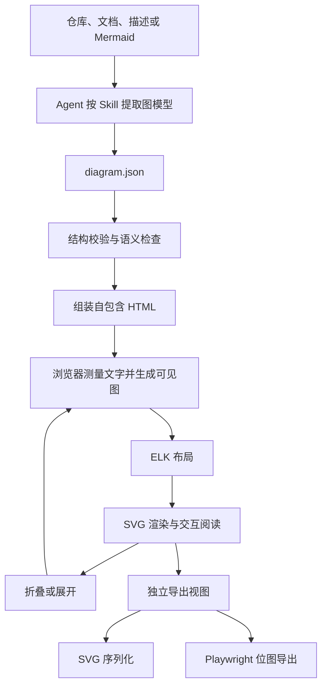

# System Blueprint v2 重构升级方案

日期：2026-09-23  
状态：设计方案，供评审；尚未开始功能实现。  
适用仓库：`system-blueprint-skill`。  
本次交付：明确重构目标、技术方案、数据与模块契约、实施阶段和验收方法。本文件中的目录、命令、接口和性能指标均为拟建设计，不代表当前仓库已经具备这些能力。

## 1. 需求与设计结论

用户对当前效果的反馈是：图不够简洁、美观、专业，风格过于模板化，而且不能交互。已确认的交互范围是阅读与探索：缩放、平移、节点详情、关联路径高亮、分组折叠。

v2 的目标是：**让 Agent 将仓库或描述转成准确的图数据，由可复用程序生成简洁、可交互、能离线分享的技术图，并输出一致的静态资产。**

核心决定：

1. 保留 skill 产品形态，以及复制 `system-blueprint/` 目录进行安装的方式。
2. 采用 TypeScript、SVG、ELK.js、d3-zoom；构建使用 esbuild，位图导出与浏览器验证使用 Playwright。
3. 引入与坐标无关的图数据，拆开内容理解、图模型、布局、视觉渲染和交互状态。
4. 默认采用浅色工程风；同一渲染器提供克制深色主题。先验证一套构图，不同时维护多套页面模板。
5. 生成自包含 HTML：内嵌图数据、CSS、JS，在断网的 `file://` 环境下可以阅读与交互。
6. 首版重点覆盖系统总览、流程和部署三类图；Memory 使用流程预设，Before / After 使用两个可比较的独立视图。
7. 静态导出默认使用全展开、无选中高亮的完整图，不能依赖用户点击详情才能理解关键条件。
8. 用现有总览图建立视觉样板，再完成通用能力及其余示例迁移。

### 1.1 范围

| 纳入 v2 | 本轮不建设 |
| --- | --- |
| 内容建模、图数据校验、自动布局、统一渲染 | 在线协作、账号、云端存储、部署服务 |
| 缩放、平移、适应画布、重置视图 | 拖拽编辑节点、修改连线、撤销重做 |
| 节点与连接详情、上游/下游高亮 | 任意 HTML 作为节点内容、插件执行系统 |
| 最多两层分组的折叠与展开 | 任意深度嵌套、超大规模知识图谱 |
| 离线 HTML、SVG、PNG、JPEG | PPTX、PDF、Figma、draw.io 格式互转 |
| 旧导出命令兼容与五个示例迁移 | 从任意旧 SVG 自动无损还原图数据 |

“本轮不建设”用于控制首版工程规模，不影响后续独立扩展。用户明确要求 Mermaid 时，继续尊重其输出格式选择。

### 1.2 成功标准

- 首屏能看清主关系和阅读方向，画布中不再堆放长段说明与重复图例。
- 图形与颜色表达含义；主干、条件分支、异常、反馈关系可辨认。
- 中文和英文长标签不穿出节点；完整图与静态导出的关键条件不被截断或只放进详情。折叠摘要须明确提示隐藏的判断与条件，见 8.3。
- 用户可以完成已确认的五类交互，并通过键盘访问节点与基本控件。
- 单文件 HTML 不需要服务端、CDN、网络字体或相邻资源文件。
- SVG / PNG / JPEG 的边、箭头、标签和分组与源数据一致。
- 复制 skill 子目录到新位置后，生成流程仍然成立；不依赖仓库根目录的源码或 `node_modules`。
- 示例、文档与自动化检查能证明以上行为，而不只证明 TypeScript 编译成功。

## 2. 当前项目基线

本节依据本次会话的源码检查与本机复现，不等同于对所有用户生成结果的统计。

| 位置 | 当前事实 | 对重构的影响 |
| --- | --- | --- |
| [SKILL.md](../../../system-blueprint/SKILL.md) | 先抽模型再生成 HTML / SVG，但模型没有结构化契约 | 建立图数据和校验入口 |
| [视觉规则](../../../system-blueprint/SKILL.md#visual-rules) | 默认深色、圆角卡片、阴影或柔光 | 将默认页面样式改为有用途的视觉规范 |
| [template.html](../../../system-blueprint/assets/template.html) | 包含固定 Hero、说明卡片、图例、手写坐标的 SVG | 拆成阅读器外壳与图形渲染程序 |
| [总览示例](../../../images/system-blueprint-overview.svg) | 多个彩色大容器，长说明超出节点，连接没有方向箭头 | 首个视觉重做和回归样例 |
| [Runtime 示例](../../../images/system-blueprint-runtime-flow.svg) | 本机 PNG 导出成功，但能看到长标签溢出；连接没有箭头 | 增加文字测量、箭头与视觉验收 |
| [Memory 示例](../../../images/system-blueprint-memory-recall.svg) | Recall Policy 底边为 458，所属容器底边为 432，越界 26 个 SVG 单位 | 增加容器包含检查 |
| [export_diagram.py](../../../system-blueprint/scripts/export_diagram.py) | 用 HTML parser 提取第一个 SVG，不保留 HTML 外部样式 | 明确导出范围，统一浏览器与 SVG 序列化路径 |
| 同一导出脚本 | 提取模板时将 `viewBox` 改成 `viewbox`；实际报 `ValueError: The SVG size is undefined` | 修复大小写与尺寸问题，建立旧模板回归测试 |
| 仓库结构 | 没有通用布局器、交互运行时、Node 构建配置或自动化测试 | 新增这些模块时同时建立分发与验证方式 |

总览中的 `Renderer` 是示意概念。当前仓库实际提供的是生成指导、HTML 模板、SVG 示例和图片导出脚本，不能将其描述为已有独立的绘图运行时。

当前工作区有未跟踪的 `.idea/`。重构不处理该目录，不删除已有文件，不进行未经用户要求的 commit 或 push。

## 3. 用户体验与视觉设计

### 3.1 页面结构

```text
┌ 标题 / 简短说明 ───────────── 主题、导出 ┐
│                                       │
│               图形画布                │
│                               节点详情│
│                               按需打开│
│                                       │
└ 缩小、比例、放大、适应画布、重置 ──────┘
```

- 初始状态不显示详情面板，不设置介绍项目的大 Hero、统计卡和底部营销说明。
- 画布是主要内容区域。1366 × 768 桌面视口下，默认至少 70% 的可用内容高度用于画布。
- 点击节点显示详情；窄屏中详情切换为可关闭的底部区域，不强行将整张图缩到不可阅读。
- 仅当图包含多种需要解释的线型或符号时显示图例。图例解释语义，不重复节点名称。
- v2 主交付为单图阅读器。五类示例可通过 README / 示例索引访问；不额外建设多图工作台。

### 3.2 初始视觉参数

以下是样板的起始设计值，需通过同一批截图统一调整，不对单张图临时打补丁。

| 项目 | 默认值或规则 |
| --- | --- |
| 浅色画布 | `#F8FAFC`；节点 `#FFFFFF`；主文字 `#172033` |
| 次级文字与边框 | `#526176`、`#D5DCE6`，实测文字与控件对比度 |
| 主强调色 | `#2563EB`，主要用于主路径、选中和焦点 |
| 语义颜色 | 异常使用红色并配合文字/线型；普通节点不逐类铺大面积彩色背景 |
| 深色主题 | 深灰蓝底色、低饱和边框，复用布局、节点形状和字号 |
| 字体 | `Segoe UI`、`Microsoft YaHei`、`Noto Sans CJK SC`、系统 sans-serif；不加载网络字体 |
| 字号 | 节点标题 15 px、简述 13 px、边标签 12–13 px、页面标题 22–26 px，均指 100% 比例 |
| 节点尺寸 | 普通节点宽度 176–240 px；高度按实际文字计算；标题最多两行 |
| 内边距与圆角 | 内边距 14–16 px；普通节点圆角 8 px；分组 10 px |
| 间距 | 同层起始间距 32 px，层间 64 px，组内留白至少 24 px，组标题单独预留 |
| 连线 | 通常 1.5 px；主路径或选中 2 px；明确箭头，标签自带背景避让 |
| 装饰 | 默认无网格、柔光、大阴影；焦点环和交互反馈不受此限制 |

标题超过两行时返回可定位的内容诊断，由 Agent 缩短标题，将说明转入详情；不自动截断标题，也不缩小字号掩盖问题。全展开状态下，关键业务条件保留在边或节点的可见文本中；用户主动折叠后的摘要与隐藏条件按 8.3 处理。

系统字体保证离线便利，但不同机器可能采用不同字形。HTML 在本机字体加载后重新测量；PNG / JPEG 用于交付确定的像素效果。

### 3.3 按图类型选择表达方式

| 类型 | 默认构图 | 必须表达的内容 |
| --- | --- | --- |
| overview | 左到右，围绕关键关系分组 | 系统边界、内部/外部组件、关键依赖 |
| flow | 上到下；线性短流程可显式选左到右 | 起止、步骤、判断条件、循环、异常路径 |
| deployment | 按部署区域分组，左到右 | 部署位置、服务实例或逻辑服务、连接含义 |
| Memory / Recall | 使用 flow 类型 | 何时检索、检索结果去向、跳过或失败条件 |
| Before / After | 两份独立 DiagramDocument，同主题同粒度 | 相同范围、对应关系及明确的变更标注 |

节点形状：`process` 为普通矩形，`decision` 为菱形，`start/end` 为胶囊形，`store` 为存储形状，`external` 为带外部标识的普通节点，`fork/join` 使用并行分叉/汇合符号。

架构中的关联不一律画成调用方向：边的 `directed` 必须明确，只有有向边绘制箭头。图类型决定校验与默认布局，不改变输入关系。

### 3.4 当前总览的重组

主线调整为“输入材料 → Agent 按 Skill 建模与绘制 → HTML / SVG → 按需导出位图”。

- 合并 `User / Prompt UI` 的低价值分隔，在输入详情中列出仓库、文档、自然语言与 Mermaid。
- 将规则、模板、绘制职责放入生成过程详情；区分当前实现与 v2 规划。
- `Example Views` 退出主流程画布，在示例索引中展示。
- 输出格式说明放进输出节点详情；图上保留必要格式名称。
- 删除仅重复分区名称的颜色图例。

重组不得凭示意图虚构当前系统已有运行组件。展示 v2 目标架构时标题明确标识“v2 设计”。

## 4. 总体架构与技术选型



### 4.1 技术职责

| 技术 | 职责 | 使用边界 |
| --- | --- | --- |
| Node.js 24.x | 生成命令、打包、导出命令 | 阅读者无需安装 Node；版本作为 v2 工具链基线 |
| TypeScript | 模型、投影、布局适配、渲染器、阅读器 | 编译后随技能包分发，无浏览器内编译 |
| JSON Schema draft-07 + Ajv | 输入结构校验、字段错误路径 | schema 为结构契约；业务图语义另行校验 |
| ELK.js | 分层布局、正交连线、分组布局 | 不承担内容提取、字体测量、美术设计和交互 |
| SVG + CSS | 矢量绘制、箭头、节点、文字 | 图形内部不使用 `foreignObject` |
| d3-zoom + d3-selection | 缩放平移与视角控制 | 不引入整个 D3 工具集合，不使用力导向模拟 |
| 原生 DOM | 工具栏、详情面板、键盘事件 | 不需要应用框架或路由系统 |
| esbuild | 浏览器 IIFE 与 Node 入口打包 | 禁用浏览器代码分包；HTML 内嵌由组装脚本完成 |
| Playwright / Chromium | 位图导出、浏览器功能与视觉检查 | SVG 由 DOM 序列化得到，不把截图当作 SVG |
| Node 内置测试工具 | 纯函数、校验、投影和打包检查 | 浏览器状态测试由 Playwright 执行 |

JSON Schema draft-07 足以表达此版结构，Ajv 使用对应默认实例。构建时生成独立校验函数，避免浏览器运行时动态编译 schema。TypeScript 类型由 `json-schema-to-typescript` 在开发构建阶段生成；生成文件不手工维护。[Ajv 独立校验代码](https://ajv.js.org/standalone.html)、[类型生成器](https://github.com/bcherny/json-schema-to-typescript)

ELK 只计算布局；其官方提供可直接在浏览器使用的 bundle。v2 初始采用内嵌 bundle、无独立 Worker 文件的模式，不承诺能大幅 tree-shake ELK。若性能门槛未通过，再评估内嵌 Blob Worker，必须重新验证 `file://` 下运行。[ELK.js 官方说明](https://github.com/kieler/elkjs)

布局首选 ELK Layered，因其支持有方向的分层图、端口约束及复合分组。层间、节点间和标签尺寸由适配器显式提供。[ELK Layered](https://eclipse.dev/elk/reference/algorithms/org-eclipse-elk-layered.html)

d3-zoom 负责输入设备兼容、缩放范围和视角变换；程序仍需处理节点点击、焦点与画布拖拽之间的冲突。[d3-zoom](https://d3js.org/d3-zoom)

### 4.2 使用环境与依赖

| 身份 | 需要安装什么 | 可以做什么 |
| --- | --- | --- |
| 阅读者 | 支持 SVG 和 JavaScript 的桌面浏览器 | 双击 HTML，离线阅读、交互、下载 SVG |
| 使用 skill 的 Agent | Node.js 24.x + 完整 skill 目录 | 校验图数据、生成 HTML，无需重新编译 |
| 需要自动 SVG/位图导出的 Agent | 上述环境 + skill 内的 Playwright 依赖 + Chromium | 等待渲染后导出 SVG、PNG、JPEG |
| 项目维护者 | 根目录开发依赖、skill 内导出依赖与 Chromium | 修改 TypeScript、构建发布资源、运行全部检查 |

生成 HTML 不启动浏览器，不要求安装 Playwright；HTML 内的图在打开时生成。自动化静态导出才需要浏览器。浏览器内的 SVG 下载使用当前内嵌渲染器，无需额外安装。

## 5. 图数据与校验契约

### 5.1 DiagramDocument

图数据保存在 UTF-8 JSON 中，不接受执行代码或自定义 HTML。稳定 ID 由 Agent 保留，显示文字变化不应迫使 ID 变化。

| 对象 | 必填字段 | 可选字段 |
| --- | --- | --- |
| 文档 | `schemaVersion: "2.0"`、`id`、`title`、`view`、`nodes`、`edges`、`groups` | `description` |
| view | `kind`、`direction`、`theme` | `collapsedGroups`、`primaryPath` |
| node | `id`、`kind`、`label` | `summary`、`details`、`groupId`、`evidenceStatus`、`sources` |
| edge | `id`、`source`、`target`、`kind`、`directed` | `label`、`details`、`evidenceStatus`、`sources` |
| group | `id`、`label` | `parentId`、`details` |
| source | `path` | `line` |

枚举与规则：

- `view.kind`：`overview | flow | deployment`。
- `view.direction`：`RIGHT | DOWN`；`view.theme`：`light | dark`。
- `view.collapsedGroups`：初始折叠的 group ID；缺省为空。
- `view.primaryPath`：按遍历顺序排列的 edge ID；缺省为空，不推断不存在的主路径。
- `node.kind`：`start | end | process | decision | store | external | fork | join`。
- `edge.kind`：`control | data | dependency | exception | feedback`。
- 流程子图由 `control | exception | feedback` 边组成，这三类边必须 `directed: true`；`data | dependency` 可以有向或无向，不计入流程分支数量。
- `evidenceStatus`：`confirmed | assumed | planned`；缺省 `assumed`。它表示信息依据，不是运行状态。
- `summary` 为短说明；`details` 为纯文本。`sources.path` 是可阅读的仓库相对引用，不自动访问磁盘或转换为执行链接。
- 节点和组的 ID 使用同一命名空间；边 ID 在文档内唯一；避免使用 DOM ID 直接拼接数据 ID。
- 原始边端点只引用节点；分组连线由可见图投影生成，不向原始数据写入虚构端点。
- 节点归属最多一个组；组深度最多两层；原始模型不保存 `x/y/width/height`。

### 5.2 最小示例：带校验分支的流程

```json
{
  "schemaVersion": "2.0",
  "id": "request-validation",
  "title": "请求校验流程",
  "description": "通过校验后执行任务，否则返回错误说明。",
  "view": {
    "kind": "flow",
    "direction": "DOWN",
    "theme": "light",
    "collapsedGroups": [],
    "primaryPath": ["e1", "e2", "e4"]
  },
  "groups": [
    { "id": "g-processing", "label": "请求处理" }
  ],
  "nodes": [
    { "id": "n-start", "kind": "start", "label": "收到请求" },
    {
      "id": "n-check",
      "kind": "decision",
      "label": "校验通过？",
      "groupId": "g-processing",
      "details": "检查必填字段和输入格式；具体规则由业务系统定义。"
    },
    { "id": "n-run", "kind": "process", "label": "执行任务", "groupId": "g-processing" },
    { "id": "n-error", "kind": "end", "label": "返回错误" },
    { "id": "n-done", "kind": "end", "label": "返回结果" }
  ],
  "edges": [
    { "id": "e1", "source": "n-start", "target": "n-check", "kind": "control", "directed": true },
    { "id": "e2", "source": "n-check", "target": "n-run", "kind": "control", "directed": true, "label": "通过" },
    { "id": "e3", "source": "n-check", "target": "n-error", "kind": "exception", "directed": true, "label": "不通过" },
    { "id": "e4", "source": "n-run", "target": "n-done", "kind": "control", "directed": true }
  ]
}
```

### 5.3 校验分层

| 层级 | 检查 | 处理方式 |
| --- | --- | --- |
| 结构 | 版本、类型、枚举、必要字段、未知字段 | 报错并拒绝生成，不静默忽略字段 |
| 引用 | 重复 ID、悬空端点、不存在的组、无效主路径 ID | 报错，提供 JSON 路径及相关 ID |
| 分组 | 父组不存在、归属成环、超过两层、空分组 | 报错，要求 Agent 合并或拆为子图 |
| 流程 | decision 在流程子图中至少两个出口，出口条件非空且可区分；流程边必须有向 | 缺条件或方向错误时报错；data/dependency 出口不计数，不得自动补写“是/否” |
| 并行 | fork 至少两个控制出口，join 至少两个控制入口 | 无法成立时报错；不替用户推断并行语义 |
| 图关系 | 普通流程环、自环、断开的子图 | 环合法；不可达子图提示警告，不当作 DAG 拒绝 |
| 主路径 | 相邻边可连续、方向明确、不重复引用同一边 | 错误时拒绝指定主路径，不改写真实连接 |
| 内容依据 | assumed / planned 或没有来源 | 详情明确标识；假设会影响理解时画布显示短标记 |

限制输入为 100 个节点、300 条边、20 个组，作为首版明确支持范围；超限报错并建议总览加子图，不截断数据。JSON 文件上限 2 MiB，单个 `details` 上限 8,000 字符，用于防止误把整个文件或日志塞进图中。数据限额和性能门槛分别验证，合法大小不代表承诺即时布局。

所有错误使用固定诊断结构：`{ code, path, ids, message, severity }`。例如 `EDGE_TARGET_MISSING` 指向 `/edges/3/target`。错误阻止交付；警告可以交付，但写入诊断报告并由 Agent 判断是否需修正。

## 6. 模块边界与目录设计

### 6.1 开发源码与可安装资源

```text
system-blueprint-skill/
├── package.json                         开发命令、工具依赖，private
├── package-lock.json                    精确锁定开发依赖
├── tsconfig.json
├── playwright.config.ts
├── src/
│   ├── model/                           生成的类型、语义校验、图索引
│   ├── projection/                      折叠可见图、原始 ID 映射
│   ├── layout/                          字体测量、ELK 适配、结果校验
│   ├── render/                          SVG 节点、边、标签、主题
│   ├── viewer/                          交互状态、详情、键盘、视角
│   ├── export/                          独立导出视图、SVG 序列化
│   └── cli/                             validate、generate、export 入口
├── scripts/                             构建、示例生成、打包校验
├── tests/
│   ├── unit/
│   ├── browser/
│   ├── fixtures/
│   └── baselines/                       固定浏览器环境的视觉基线
├── examples/                            五类示例的 diagram.json
├── images/                              README 静态示例，维持现有路径
├── docs/superpowers/specs/               本设计方案
└── system-blueprint/                     复制此目录即可安装
    ├── SKILL.md
    ├── agents/openai.yaml
    ├── package.json                      仅声明导出所需 Playwright 依赖
    ├── package-lock.json                 锁定上述可选安装环境
    ├── references/
    │   ├── diagram-schema.json           模型结构唯一源文件
    │   ├── modeling.md                   图类型、语义、来源和拆图规则
    │   └── visual-guidelines.md          视觉规范与图形示例解释
    ├── assets/
    │   ├── template.html                 新阅读器外壳
    │   ├── viewer.js                     预构建浏览器 IIFE，含布局与校验
    │   ├── viewer.css                    由生成器内嵌
    │   └── legacy-template.html          保留 v1 模板用于旧文件兼容
    ├── scripts/
    │   ├── validate.mjs                  预构建，Node 即可运行
    │   ├── generate.mjs                  预构建，Node 即可运行
    │   ├── export.mjs                    预构建，按需加载 Playwright
    │   └── export_diagram.py             保留旧命令与参数
    └── THIRD_PARTY_NOTICES.md            随包依赖与许可说明
```

开发依赖与 skill 中的导出依赖各自锁定，构建检查两处 Playwright 版本一致。浏览器脚本、校验脚本、生成脚本打包必要库；导出脚本将 Playwright 作为显式外部依赖，从 skill 自身的安装目录解析，不能意外借用仓库根目录依赖。

预构建资源随 skill 一起分发。维护者修改源码后必须重新构建，自动检查发布资源是否与源码一致；不让普通使用者手工复制 `src/` 或执行 TypeScript 构建。

### 6.2 核心接口

以下为职责契约，实际 TypeScript 类型由 schema 与模块实现补齐；这里不要求新建统一服务层或插件抽象。

```ts
validateDocument(input: unknown): ValidationResult;
buildGraphIndex(document: DiagramDocument): GraphIndex;
projectVisibleGraph(document: DiagramDocument, collapsed: ReadonlySet<string>): VisibleGraph;
measureGraph(graph: VisibleGraph, theme: ThemeTokens): Promise<MeasuredGraph>;
layoutGraph(graph: MeasuredGraph, view: DiagramView): Promise<LayoutGraph>;
renderGraph(graph: LayoutGraph, theme: ThemeTokens): SVGSVGElement;
findRelated(index: GraphIndex, selection: Selection, direction: "upstream" | "downstream", viewKind: DiagramView["kind"]): RelatedSet;
createExportSvg(document: DiagramDocument, options: ExportOptions): Promise<SVGSVGElement>;
```

- `ValidationResult`：合法文档或带路径的诊断，不返回半合法文档。
- `GraphIndex`：原始节点、边、分组、上下游关系的查询索引。
- `VisibleGraph`：显示节点/边，以及每项对应的原始节点/边 ID 集合。
- `MeasuredGraph`：可见图加文字行、节点/端口/标签尺寸。
- `LayoutGraph`：测量数据加坐标、连线折点、边标签位置和画布边界。
- `DiagramView`：文档的 view 配置；交互状态另存，不写回它。
- `Selection`：节点或分组 ID；`RelatedSet` 使用原始 ID 表达关系。边点击只展示关系详情与端点，不作为上下游遍历的起点。
- `ThemeTokens`：颜色、字体、几何和线宽；首版两主题共享几何参数。
- `ExportOptions`：`theme` 和图导出范围；v2 范围固定为全展开完整图。

模块不得从 UI DOM 反向猜测业务关系。DOM 只展示模型与状态，图索引负责关系计算。

## 7. 布局与渲染实现

### 7.1 文字测量

1. 等待 `document.fonts.ready`，用固定字体栈创建参与计算但不可见的测量 SVG。
2. 使用真实字体度量，不按“中文每字固定宽度”估算。
3. 英文优先按词换行，超长标识符再按字符分段；中文按字符边界处理。
4. 节点标题最多两行、summary 最多两行；超出时给出内容诊断，不用省略号隐藏关键标题。
5. 边标签独立测量，最多三行；超出时要求 Agent 精简条件表达或拆成子流程，不能删除条件。
6. 菱形等特殊形状按内部可用文本区域计算外接框；组标题占用单独的顶部空间。

### 7.2 布局适配

- 默认 `elk.algorithm = layered`，连线使用正交路由，方向来自 view。
- 显式传入节点、端口、标签尺寸；分组使用复合图，配置跨层边处理。
- 主路径和输入顺序作为布局偏好，不能凭偏好改变边方向或删掉回边。
- 有向边在真实形状边界结束，箭头不得进入文字区。起止端口避开组标题。
- 将 ELK 的分组局部坐标统一转换为渲染坐标，避免跨组边偏移。
- 渲染顺序为组背景、边、节点、边标签、焦点/选中反馈。
- SVG 使用 `text/tspan`、`path`、`rect`、`polygon` 和 `marker`；关键样式保存在 SVG 内。

ELK 可以减少交叉和绕线，但不能承诺任意图零交叉。质量检查区分“节点被边穿过”“文字被遮挡”等错误，以及“仍有交叉、图过长”等需要调整布局或拆图的警告。

### 7.3 布局完成与失败

阅读器提供 `window.blueprint.ready` Promise，覆盖模型校验、字体、初始布局和 SVG 绘制。失败时 reject，并显示可理解的错误；导出命令不能只等一个固定延时便截图。

后续重排提供 `window.blueprint.whenIdle()`。异步任务带递增 revision，只允许最新有效结果更新 UI；同一时刻至多一个布局运行，其后合并为最新一次待处理请求。

导出自动化接口固定为 `window.blueprint.exportSvg(options): Promise<string>` 与 `window.blueprint.prepareRasterExport(options): Promise<{ elementId, width, height }>`；后者在同一页面建立独立、可截图但不影响阅读画布的导出容器。`window.blueprint.disposeExport(elementId)` 在导出后释放该容器。三者复用 `createExportSvg`，不各自实现布局逻辑。CLI 在调用前验证这些接口存在，缺失时报告输入类型不匹配，而不是一直等待。

无 Worker 的 ELK 布局可能阻塞主线程，普通定时器无法保证中止计算。初版依靠输入限额和性能测试控制风险，不宣称已有可中断布局。如果合格规模仍导致明显冻结，Worker 方案是发布前必须完成的改进，不能仅增加“加载中”提示绕过验收。

## 8. 交互状态与行为

UI 状态包括 `selectedId`、`selectedKind`、`highlightDirection`、`collapsedGroups`、`viewportTransform`、`theme`、`layoutRevision`。原始文档只读，首版不写本地存储。

### 8.1 缩放、平移与复位

- 支持画布拖拽平移、滚轮/触控缩放、放大缩小按钮；常规手动缩放范围 25%–300%。
- 工具栏、详情面板上的滚动不触发画布缩放；超过可交互范围的大图建议拆分，不无限缩小。
- 适应画布根据图的完整包围盒和安全留白计算视角，只改变视角；允许进入低于 25% 的总览比例，并提示“总览比例，放大查看文字”。从该状态继续放大时保持倍率连续，允许区间临时以当前总览比例为下限；达到 25% 后恢复常规下限。再次进入更小比例必须主动选择适应画布。
- 重置视图关闭详情、清除高亮、恢复文档初始折叠状态并适应画布；保留当前主题。
- 拖拽超过阈值后不触发节点点击。详情面板开关不自动重置视角。
- 折叠重排时尽量保持被操作组的屏幕锚点，避免每次跳回全图；布局位置不保证完全不变。

### 8.2 详情与关系高亮

- 点击节点或按 Enter 打开详情，包含标题、说明、输入/输出关系、信息依据与来源引用。
- 没有 details 的节点仍展示可用关系，不生成空白面板。
- 点击边显示起止节点、关系类型、完整条件，并高亮该边与端点；聚合边展示原始关系列表。边详情不提供含义不明的上下游遍历入口。
- 节点或组选择“上游/下游”后，在原始图上遍历，再投影为可见对象；使用 visited 集合处理循环。flow 视图只遍历流程子图，overview/deployment 视图遍历所有有向关系；数据与依赖关系仍列在节点详情中。
- 无向依赖只在直接关联信息中显示，不自动纳入上下游流程遍历。
- 选择折叠组时使用其成员节点集合查询；面板显示组级聚合关系，不宣称组内任意入口都可到任意出口。
- Escape 关闭详情与高亮，返回之前的节点焦点；点击空白区清除选中。
- 高亮仅改变表现，不生成流量动画，不暗示图正在执行。

### 8.3 分组折叠算法

1. 保留 `DiagramDocument` 与 `GraphIndex`，复制 UI 折叠集合用于当前 revision。
2. 为每个原始节点找到最外层被折叠的祖先组；没有则保留自身作为显示节点。
3. 被折叠组变成摘要节点，显示组名与内部节点数量；存在隐藏的 decision 或带条件流程边时，显示“含 X 个判断 / Y 个条件，展开查看”。这明确表示信息被缩略，不能把摘要当成内部无条件的执行步骤。
4. 原始边两端分别映射为显示端点。两端因折叠落到同一个组时，作为该组内部关系隐藏并计数；真实可见节点自环继续保留。
5. 跨组边保留方向、类型、条件及原始边 ID。只有显示端点、方向、类型、标签完全一致时才允许聚合；不同条件不得合并为一条无条件边。
6. 聚合边记录全部原始边映射，点击可查看；不同 label 仍独立绘制，必要时由布局提供独立端口与标签空间。
7. 测量可见图、重新布局与绘制，只提交最新 revision。
8. 展开父组后恢复此前子组折叠状态；父组折叠时选中的内部节点转为选中父组。

必须包含如下回归场景：组内有“成功”和“失败”两条边指向同一外部节点，折叠后仍能辨认两种条件；组内存在回路，折叠和展开均不丢失原始边。

折叠态是允许隐藏组内细节的显式例外：组详情必须列出全部隐藏流程条件，展开后恢复原文；跨组边条件仍直接显示。还需测试“条件边完全在组内，出口边无条件”的场景，摘要必须出现隐藏条件提示。静态导出强制全展开，因此所有条件在导出图中恢复可见。

### 8.4 可访问性

- 工具栏用原生按钮，节点可聚焦，SVG 设置可理解的标题和描述。
- Tab 可遍历主要节点；Enter 打开详情，Escape 返回，分组按钮声明 `aria-expanded`。
- 不只用颜色传达条件、异常或选中；提供文字、箭头、线型或焦点边框。
- 尊重减少动态效果的系统偏好；默认不添加装饰动画。
- 375 px 窄屏保留画布平移与详情入口，工具栏不能溢出视口。

## 9. 离线打包、导出与命令

### 9.1 单文件 HTML

生成器将文档 JSON、预构建 JS、CSS 和外壳组装进同一个 HTML。使用浏览器 IIFE，不依赖模块加载、运行时 `fetch`、CDN、独立 Worker 文件或外部字体。esbuild 的职责是打包 JS，HTML 组装由生成器负责。[esbuild 构建格式](https://esbuild.github.io/api/#format)

JSON 内嵌必须转义 `<` 等能终止 script 元素的内容；显示标题、说明、来源时使用文本节点。数据不允许成为 HTML、CSS、JS 或 SVG 属性片段。源代码材料中即使包含标签或脚本，也只能作为文字显示。

HTML 内嵌的详情同样属于交付内容。Skill 在生成前只收录必要的源码位置与说明，不包含凭证、真实用户记录或整份私有配置；“折叠”不构成内容脱敏。

禁用 JavaScript 的环境显示静态说明与可访问的模型摘要，不承诺完整交互图；需要无脚本查看时交付独立 SVG。

### 9.2 导出契约

| 产物 | 默认包含 | 默认不包含 |
| --- | --- | --- |
| HTML | 图模型、交互阅读器、详情、初始 view | 外部资源、自动网络访问 |
| SVG | 全展开图、标题、必要说明、完整标签、箭头、背景与必要图例 | 工具栏、详情面板、选中态、视角变换、脚本 |
| PNG / JPEG | 上述 SVG 的完整画布渲染结果 | 页面外壳、用户当前缩放产生的裁切 |

静态导出不修改正在浏览的图。单独创建导出视图，使用空折叠集合和当前主题，完成测量、布局与绘制后再输出。关键条件始终可见；长实现说明保留在 JSON / HTML 详情中。用于测量的容器可以在屏幕外，位图截图时的导出容器必须有真实尺寸且可被截图，不能使用 `display:none`、透明度 0 或依赖不可见元素截图。

SVG 设置明确的 `xmlns`、`width`、`height`、`viewBox`，包含字体栈、颜色、背景矩形、marker 与必要样式，通过 `XMLSerializer` 保留大小写。不得把工具栏或缩放用的外层 transform 一并序列化。

PNG / JPEG 由 Playwright 打开自包含 HTML、等待 ready、调用独立导出视图，再截取完整图容器；SVG 由页面接口返回序列化结果。Playwright 截图本身输出位图。[Playwright 截图](https://playwright.dev/docs/screenshots)

默认 scale 为 2，允许范围 0.5–4。输出任意边超过 16,000 像素或总像素超过 40,000,000 时停止并建议降低 scale 或拆图，不悄悄裁切。JPEG 使用显式背景；实际文件类型必须与 format 一致，扩展名冲突时报错。

首版浏览器工具栏提供 SVG 下载；PNG / JPEG 通过 CLI 交付，避免另写一条可能字体不一致的 Canvas 位图导出链路。

### 9.3 拟提供的 CLI

下列命令是实现目标，目前尚不可运行。

```powershell
# 仅 Node.js 即可校验与生成 HTML
node system-blueprint/scripts/validate.mjs examples/request-flow.diagram.json
node system-blueprint/scripts/generate.mjs examples/request-flow.diagram.json --output output/request-flow.html

# 仅在需要自动静态导出时，安装 skill 内已锁定的依赖和浏览器
npm ci --prefix system-blueprint
node system-blueprint/node_modules/playwright/cli.js install chromium

# 自动导出：SVG 不指定 scale；scale 只用于位图
node system-blueprint/scripts/export.mjs output/request-flow.html --format svg --output output/request-flow.svg
node system-blueprint/scripts/export.mjs output/request-flow.html --format png --scale 2 --output output/request-flow.png
node system-blueprint/scripts/export.mjs output/request-flow.html --format jpg --background "#FFFFFF" --output output/request-flow.jpg
```

- 入口基于脚本自身位置解析资源，不依赖调用时的工作目录。
- 文件路径支持空格和中文；输出目录按需创建。
- 覆盖已有文件必须显式使用 `--overwrite`；否则报错并保留原文件。
- 输入错误与参数错误退出码为 2，依赖/浏览器/渲染失败为 1，成功为 0。
- validate 和 generate 都执行模型校验；generate 在写文件前完成校验，并采用临时文件完成后替换的写入方式。
- generate 成功只表示 HTML 组装成功；最终可交付状态还需浏览器验证。不会把未打开的文件标成“已视觉验证”。

## 10. Skill 工作流升级

主入口保留目标、路由、必要约束与命令；模型和视觉细节放到对应 references，按需读取。

推荐工作流：

1. 判断输入材料、目标读者、使用场景、图类型和输出要求；能合理推断时直接推进。
2. 提取节点、关系和必要条件。仓库输入核对实际调用和配置；设计讨论区分已确定、假设和规划。
3. 控制图的粒度：总览突出系统边界，流程保留分支/循环。超过支持范围时拆成总览与子图，显式交代被合并内容。
4. 输出 `diagram.json`，执行校验并修正错误；不能通过删除必要分支来消除布局问题。
5. 生成 HTML，运行浏览器检查，按诊断修正文本、分组或构图。
6. 根据任务输出 HTML 与必要静态资产；保留图数据以便后续修改。
7. 交付文件链接、内容范围、关键假设和验证边界。

主指令不再要求每张图都套固定深色模板；默认交互阅读器允许使用随包脚本，但继续禁止依赖远程运行资源。`agents/openai.yaml` 与 README 同步更新触发说明、默认输出和安装依赖。

增量编辑优先修改图数据并保留 ID。只有 HTML 时尝试读取 v2 内嵌数据；如果是无模型的 v1 文件，按旧图语义人工重建 JSON 或保留旧文件做局部修订，不承诺自动精确还原。

生成器返回失败、浏览器不可用时，明确交付状态：可以提供经过结构校验的 JSON / HTML 源文件，但必须注明视觉未验证；不能无提示改成用户没有要求的另一种输出。

## 11. 兼容与迁移

### 11.1 文件与命令

- 原有已生成 HTML / SVG 继续作为静态文件使用，不批量改写。
- 将现有模板保留为 `legacy-template.html`；新版 `template.html` 成为阅读器外壳。
- 保留 `export_diagram.py` 的输入及 `--format / --output / --scale / --background` 参数。
- 旧 SVG 的 PNG / JPEG 导出保留 Python、CairoSVG、Pillow 路径，支持范围沿用 CairoSVG；不承诺它复现全部浏览器滤镜效果。
- 旧 HTML 和 v2 HTML 均由 Python 入口转交 Node / Playwright 导出。旧参数名称与输出用途保留，但 HTML 导出新增 Node / Playwright 依赖，必须在帮助、README 与缺依赖报错中说明；不再将浏览器 HTML 样式等同于 CairoSVG 的能力。
- v2 HTML 使用内嵌的 schema 标识和阅读器接口；旧 HTML 走显式 legacy 分支，通过浏览器 DOM 定位 SVG，等待本地字体后截取其完整边界。位图按实际浏览器渲染得到继承字体、CSS 背景与滤镜效果，不经 HTML parser 重写 SVG 标签。
- legacy 输入只支持静态 HTML 内联 SVG，不执行输入中的页面脚本；不能导出需要执行第三方脚本才能生成的旧图。阻止远程资源请求，缺少本地自包含内容时明确报错；现有仓库模板属于验收范围。
- 多 SVG 的旧 HTML 新增 `--svg-index` 参数，使用从 0 开始的索引；缺省仅在恰好一张 SVG 时成功，否则列出可选索引并报错，避免默认遗漏后续图。该参数同时传递到 Node legacy 分支。
- 新入口默认防覆盖；旧入口为兼容保留已有覆盖行为，并在帮助中说明。测试同时固定这两个明确的行为边界。
- v2 的图数据以 `schemaVersion` 控制格式；不支持的版本拒绝读取，不猜测兼容。

旧 HTML 的兼容导出目标是指定的图区域；整页截图不在本轮接口范围内。不能把“HTML 输入”描述成“页面所有内容必定进入图片”。

legacy 分支只兼容旧的 PNG / JPEG 用途；`--format svg` 的自动化导出要求 v2 HTML。旧 SVG 可以直接复制使用，旧 HTML 到独立 SVG 的任意样式转换不列入首版承诺。JPEG 的原背景参数与格式严格性在兼容测试中保留。

### 11.2 五个现有示例

| 原示例 | 迁移方式 | 必查点 |
| --- | --- | --- |
| System Overview | 简化主线，实现说明移入详情 | 不把概念 Renderer 当成已实现服务 |
| Runtime Flow | 有向流程与阶段分组 | 顺序、箭头、长标签和流程回路 |
| Memory / Recall | 使用流程预设，清楚表达选择性检索 | 检索条件、不检索路径、容器边界 |
| Deployment Topology | 使用部署预设 | 位置边界、依赖含义、跨组连线 |
| Before / After | 两个独立模型，同主题与粒度；并排生成静态对比图 | 范围可比较、对应关系、变更说明 |

README 中原有五张 SVG 的路径继续保留；由新模型生成的新静态资产通过验收后再替换。交互示例的 HTML 是独立下载文件，不能暗示 GitHub README 内的图片具备交互。

Before / After 的静态合成由 `scripts/compose-comparison.mjs` 负责，仅用于示例生成：接收 before/after 两个已完整导出的 SVG，统一主题与字号，保持相同比例并排摆放，按最大高度留白，不分别缩放成同宽。对两侧 SVG 的 ID 及 `url(#...)` / href 引用添加独立前缀，避免 marker 和渐变冲突；补充两侧标题后输出 `images/system-blueprint-before-after.svg`。交互交付为两份 HTML 的明确链接，不新增多文档 schema 或工作台。合成脚本需测试 ID 引用、对齐、完整边界和导出效果。

## 12. 验证与验收

### 12.1 最小测试矩阵

| 编号 | 输入或动作 | 应有结果 |
| --- | --- | --- |
| V01 | 单节点、无边 | 正常显示与导出，适应画布不会除零 |
| V02 | 中文长标题、英文标识符、两行说明 | 正确测量和换行；超出内容限额明确报错 |
| V03 | decision 含“通过/不通过”两出口 | 画布和导出均保留条件与方向 |
| V04 | 正常流程、异常边、反馈回路、自环 | 合法渲染；上下游遍历终止且结果正确 |
| V05 | 两层分组，父子交替折叠 | 父子状态恢复，隐藏对象不残留焦点 |
| V06 | 两条不同条件边映射到相同组端点 | 条件不合并丢失；详情可追踪原始边 |
| V07 | 快速折叠、展开、切换主题 | 旧布局不覆盖新状态；失败保留可解释状态 |
| V08 | 缩放平移后导出 | 导出完整图，无视角裁切、无工具栏 |
| V09 | 节点或组名称包含 HTML/script 片段 | 仅显示文字，不执行脚本、不发请求 |
| V10 | 文件路径含中文、空格，目标已存在 | 正确读写；新命令未授权覆盖时报错 |
| V11 | 缺失端点、重复 ID、组循环、不支持版本 | 指向具体字段的诊断，非零退出码 |
| V12 | 超过模型/位图尺寸限额 | 明确失败，不静默删内容或裁切 |
| V13 | 复制 skill 子目录到仓库外的新目录 | 无根目录依赖仍可生成 HTML；按包内依赖完成导出 |
| V14 | 断网，通过 file:// 打开 HTML | 无外部请求，全部指定交互正常 |
| V15 | 独立重新打开 SVG 与检查 PNG/JPEG | 字体可读、颜色和箭头正常、尺寸及文件类型正确 |
| V16 | 键盘操作及 375 px 窄屏 | 可开关详情与分组，工具栏不越界 |
| V17 | 旧模板 HTML、旧 SVG、多个 SVG 的 HTML | 兼容导出成功或给出明确选择提示，重现的尺寸错误消失 |
| V18 | 五类旧示例的新版输出 | 每张做内容核对和截图审查，不能只以快照更新判定通过 |
| V19 | 条件边完全在折叠组内，组出口无条件 | 摘要提示隐藏判断/条件；详情可读，展开及静态导出完整恢复 |
| V20 | decision 混合 control、data、dependency 出口 | 只按流程子图校验分支；无向流程边拒绝；高亮遵循 view 类型 |
| V21 | 375 px 窄屏展示合法的长流程 | 适应画布可进入小于 25% 的总览比例；放大连续，内容无裁切丢失 |
| V22 | Before / After 含相同 marker / gradient ID | 合成后两侧引用独立，字号比例一致，标题与完整画布正常 |

纯函数测试覆盖语义校验、图索引、折叠投影、聚合边映射和循环遍历。浏览器测试覆盖文字测量、实际交互、导出、离线打开、键盘与截图。每个行为变更先补充可复现用例，避免只测试内部函数被调用。

### 12.2 视觉验收

- 在 1366 × 768、1920 × 1080 和 375 × 812 下检查；浅色作为主基线，深色检查同一组关键状态。
- 静态几何检查：节点不重叠、文字在边界内、子节点位于容器内、箭头端点不穿节点、画布包含标题与标签。
- 人工看图：阅读方向清楚、主路径突出、信息密度适当、分组有必要、没有装饰压过内容。
- 截图基线固定浏览器版本、操作系统和字体环境；跨系统主要比较几何与语义，不将字体像素差异直接当作产品回归。
- 初始/选中/高亮/折叠/展开/导出状态分别验证；一张初始截图不证明交互正确。

### 12.3 性能与体积目标

以下是待验证的验收目标，当前未测得 v2 性能：

| 指标 | 测量方法 | 目标 |
| --- | --- | --- |
| 单文件大小 | 30 节点标准样例，未压缩 HTML | 不超过 3 MiB；超出需解释主要来源并优化后复审 |
| 首次就绪 | 固定参考机器，30 节点/45 边/3 组，重复 10 次 | p95 ≤ 1.5 秒，从脚本启动到 ready |
| 折叠/展开 | 同一样例，重复 20 次 | p95 ≤ 500 毫秒，从操作到新图绘制 |
| 支持范围上沿 | 100 节点/300 边/20 组合法样例 | 正确完成，无数据丢失；记录耗时、长任务与交互阻塞 |
| 缩放平移 | 已布局图连续操作 | 不重新执行 ELK；无明显停顿，记录浏览器性能轨迹 |

参考机器、浏览器版本、字体和文件大小随测试报告记录。上限样例不达标时，先优化投影/测量缓存和布局调度，必要时引入内嵌 Worker；不能在文档中伪称已支持而默默缩小输入。

### 12.4 构建与 CI 目标

实现阶段新增以下命令，当前尚不存在：

```powershell
npm ci
npm ci --prefix system-blueprint
node system-blueprint/node_modules/playwright/cli.js install chromium
npm run typecheck
npm run test:unit
npm run build
npm run test:browser
npm run test:package
npm run examples:check
```

维护者与 CI 都安装根目录开发依赖和 skill 子目录导出依赖，并按以上入口准备 Chromium。Linux CI 需要的浏览器系统依赖在环境初始化中显式安装。`test:package` 在临时复制目录内再次按该目录的 lockfile 安装导出依赖，并从无仓库根目录可访问的工作目录运行，验证生成器无须安装、导出器依赖闭合。

CI 使用非敏感 fixture：结构与单元检查、构建、浏览器功能检查、复制后分发检查。视觉基线在固定环境执行；Windows 做路径和离线打开兼容验证。失败截图作为排障产物保留，不自动更新期望图。构建、测试与导出不调用远程 AI API。

## 13. 分阶段实施与评审点

本节给出实施顺序和可验收交付；代码级任务拆分在本设计方案评审后进行。阶段完成以产物与检查为准，不以预计工时为准。

| 阶段 | 主要工作与涉及位置 | 可审查交付 | 进入下一阶段的条件 |
| --- | --- | --- | --- |
| M0：基线与骨架 | fixture、开发构建配置、schema、基础校验；记录现有导出失败 | 可校验的 JSON 示例、复现用例、构建骨架 | 模型能表达分支/回路/分组，坏输入有准确诊断 |
| M1：视觉样板 | render、viewer 外壳、theme；按目标模型重做当前总览 | 一张新版 HTML 与实际截图，基础缩放和平移 | 用户可评估简洁度与专业感；文字与边界检查通过 |
| M2：通用布局 | measurement、ELK adapter、group 坐标、连线标签 | 总览、条件流程、部署各一个可重复生成样例 | 中文/回路/跨组边与图形边界正确 |
| M3：阅读交互 | 图索引、详情、上下游高亮、两层折叠、键盘 | 交互测试与选中/折叠状态截图 | 原始关系不丢失，状态竞态用例通过 |
| M4：自包含与导出 | generator、SVG serializer、Playwright CLI、兼容 Python 入口 | HTML / SVG / PNG / JPEG、复制后安装验证 | 离线与导出一致性通过，旧模板回归通过 |
| M5：Skill 与示例迁移 | SKILL、references、agents 元数据、README、五类 examples/images | 完整可分发 skill、新旧效果对照、验证报告 | 独立 Agent 可依文档完成任务；五类示例通过内容和视觉审查 |

M1 的画布实现先使用真实模型和简单可替换布局，避免丢弃式页面样稿；M2 将布局接入同一渲染接口。M4 的发布前必须完成从 skill 独立目录运行的测试。

M5 增加一次独立 Agent 使用评估：提供同一份真实需求和原始材料，让未参与实现的 Agent 仅依 skill 生成图，检查建模、调用命令、语义保留、交付文件与验证报告。不要把预期答案或已知缺陷直接写进评估提示。

## 14. 风险、影响与处理

| 风险/影响 | 处理与验证 |
| --- | --- |
| 新增 Node 与浏览器工具链 | 区分阅读者、生成者、导出者依赖；提供预构建资源；保留旧导出入口 |
| ELK 增大 HTML 体积 | 用实际产物测量；不加载整个 D3；不把远程 CDN 作为减包手段 |
| 自动布局不能保证所有复杂图美观 | 支持有限输入规模、质量诊断与合理拆图；视觉检查仍是交付步骤 |
| 主线程布局卡顿 | 建立性能门槛；未通过时实现并验证内嵌 Worker，再发布 |
| 折叠造成条件或关系遗漏 | 原始模型只读、投影保留 ID 映射、不同条件不合并、逐边回归检查 |
| 系统字体导致跨机差异 | 动态测量、固定环境截图；需要确定像素时提供 PNG / JPEG |
| HTML 内嵌数据包含危险内容或敏感材料 | 严格结构校验、纯文本渲染、内嵌转义；交付前检查实际包含内容 |
| 旧图没有图数据，不能可靠自动迁移 | 保留文件，以语义重建或局部修订处理，明确人工核对范围 |
| 预构建资产与源码脱节 | 同步构建、记录 bundle/schema 版本、打包一致性检查 |
| 性能承诺超过已测范围 | 报告实际样本和机器，不从简单样例推断任意规模 |

新增依赖记录精确版本并随包保留相应许可声明，尤其是内嵌到 HTML 的第三方代码。许可证清单作为发布包装的一部分，不改变本轮只写设计方案的范围。

## 15. 最终交付清单

- [ ] 可从图数据生成离线 HTML 的独立命令。
- [ ] 浅色默认、深色可选的统一视觉系统。
- [ ] 缩放、平移、适应画布、重置、详情、上下游高亮和两层分组折叠。
- [ ] 结构、语义、文字和几何诊断。
- [ ] 自包含 SVG 与浏览器渲染的 PNG / JPEG 导出。
- [ ] 旧 Python 命令兼容、已复现导出错误的回归验证。
- [ ] 同步更新的 Skill、引用文档、默认提示词、安装与使用说明。
- [ ] 五类示例的源 JSON、交互 HTML 和 README 静态图。
- [ ] 单元、浏览器、离线、分发与兼容性验证结果。
- [ ] 实际视觉对比、性能与体积记录，以及未覆盖边界。

## 16. 技术参考

以下官方资料用于核对选型能力；“文档支持”不等于本项目已经实现或验证。

- [ELK.js：布局职责、浏览器 bundle、Worker 使用方式](https://github.com/kieler/elkjs)
- [ELK Layered：分层布局、端口及复合图](https://eclipse.dev/elk/reference/algorithms/org-eclipse-elk-layered.html)
- [d3-zoom：视角控制、鼠标与触控输入](https://d3js.org/d3-zoom)
- [esbuild：浏览器 IIFE 格式](https://esbuild.github.io/api/#format)
- [Playwright：安装与运行要求](https://playwright.dev/docs/intro)
- [Playwright：位图截图](https://playwright.dev/docs/screenshots)
- [Ajv：JSON Schema 版本与校验](https://ajv.js.org/json-schema.html)
- [Ajv：预编译的独立校验函数](https://ajv.js.org/standalone.html)
- [json-schema-to-typescript：从 schema 生成类型](https://github.com/bcherny/json-schema-to-typescript)
